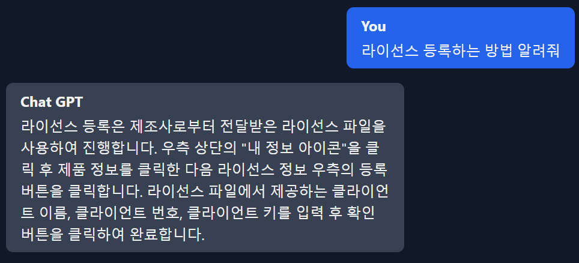
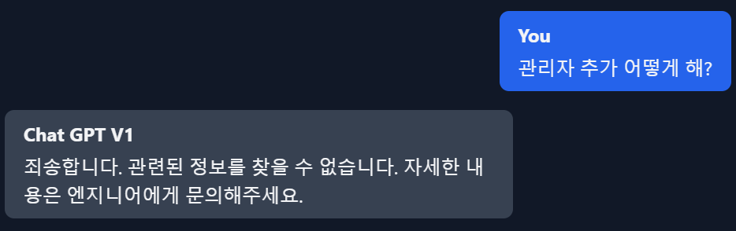

# ACRA Point 메뉴얼 RAG 도입기 - 2

## Gemini에서 발생하는 문제 해결하기
---

우선 ChatGPT를 활용한 코드에서는 아래와 같은 질문에는 올바른 대답이 왔습니다.



그러나 동일한 문서와 동일한 코드에서 AI 모델을 Gemini로만 변경했을 때는 아래와 같은 답변이 왔습니다.


원인을 확인해보니 ChatGPT로 질문했을 때는 필요한 문서를 잘 검색(retrieve)해왔지만 Gemini를 사용했을 때는 검색해온 문서가 연관이 없는 문서들이여서 답변을 못했습니다.


## 해결방법
---

왜 문서를 못가져왔나 고민해봤을 때 이유는 2가지였습니다.

1. 검색을 못해서.  
2. 임베딩을 못해서.

저는 AI 모델의 한계성을 느끼고 `검색을 못해서`가 문제라고 생각해서 문서 분할하는 방식부터 고쳤습니다.

### 문서 분할 방식 개선

기존 방식은 PDF를 로드하고 특정 사이즈만큼 Chunk를 잘라서 문서를 만드는 방식이였습니다.

이 방식의 문제점은 같은 단어들이 의미가 다른 영역에 전체적으로 작성되어있기 때문에 ChatGPT보다는 성능이 낮다고 평가되는 Gemini는 유사도 분석에서 어려움을 겪었습니다.  

그래서 모든 문서를 대상으로 검색을 진행하는 것이 아니라 임의로 선별한 문서들을 먼저 확인하고 유사한 문서가 있다면 그 문서의 자식 문서에서 유사한 문서를 찾는걸 이어나가도록 변경했습니다.

이 방식의 단점은 기존 문서를 사용하지 못하고 새롭게 규격에 맞게 문서를 작성해야한다는 단점이 있었습니다.  
그렇지만 모든 내용을 새로 쓴다기 보다는 문서의 섹션 분할만 다시 해주면 되기도 하고 관리자 매뉴얼 특성상 내용이 엄청 많지는 않기 때문에 할 수 있었던 작업입니다.

예시로 아래와 같이 작성했습니다.

```text
29. 사용자
- 사용자 목록에서 사용자 계정에 대한 전반적인 관리를 수행할 수 있다.
.
.
.

29.1) 사용자 계정 추가
...
- 방법: 사용자 계정을 추가하려면 자원 > 사용자 페이지에서 ...
- 설명: ...

29.2) 사용자 계정 상세보기
...
- 방법: 사용자 계정을 상세보기하려면 자원 > 사용자 페이지에서 ...


```

문서 분할하면서 다양한 시행착오를 거치며 최적의 방법을 찾았고 이 문서를 토대로 임베딩 하도록 코드를 변경했습니다.


기존처럼 PDF를 로드하고 차이점은 `\n`을 기준으로 모든 내용을 한 줄로 합쳤습니다.

```typescript
    const loader = new PDFLoader(filePath);
    const rawDocs = await loader.load();
    const fullText = rawDocs.map((doc) => doc.pageContent).join('\n');
```

한 줄로 합쳐진 값을 섹션별로 나누는 작업을 진행했습니다.

```typescript
    const rootSection = this.parseStructure(fullText);
```

섹션별로 나누는 코드는 아래와 같습니다.

```typescript
    interface Section {
        id: string;
        title: string;
        content: string;
        metadata: Record<string, any>;
        subsections: Section[];
    }

  private parseStructure(text: string): Section {
    const lines = text.split('\n'); // 텍스트를 줄 단위로 분리
    const rootSection: Section = {
      // 최상위 섹션 생성
      id: 'root',
      title: 'Root',
      content: '',
      metadata: {},
      subsections: [],
    };
    let currentSection = rootSection; // 현재 작업 중인 섹션
    const sectionStack: Section[] = [rootSection]; // 섹션 스택 초기화

    lines.forEach((line) => {
      // 섹션 헤더 인식을 위한 정규식
      const sectionRegex = /^(\d+(\.\d+)*(-[a-z])?)(\)|\.)?\s*(.*)$/;
      const sectionMatch = line.match(sectionRegex);

      if (sectionMatch) {
        // 새로운 섹션 헤더를 만났을 때
        const [fullMatch, id, , , separator, title] = sectionMatch;

        // 새 섹션 객체 생성
        const newSection: Section = {
          id,
          title: title.trim(),
          content: '',
          metadata: {},
          subsections: [],
        };

        // 적절한 위치에 새 섹션 배치
        while (
          sectionStack.length > 1 &&
          !id.startsWith(sectionStack[sectionStack.length - 1].id)
        ) {
          sectionStack.pop(); // 상위 레벨로 이동
        }

        currentSection = sectionStack[sectionStack.length - 1];
        currentSection.subsections.push(newSection); // 새 섹션 추가
        sectionStack.push(newSection);
        currentSection = newSection;
      } else if (line.trim() !== '') {
        // 일반 텍스트 라인
        currentSection.content += line.trim() + '\n'; // 현재 섹션에 내용 추가
      }
    });

    return rootSection;
  }
```


섹션으로 분류된 값을 `List<Document>`로 변환하여 chunk를 나눈것처럼 반환하는 작업을 겨쳤습니다.

```typescript
    async loadAndPreocessPdf(): Promise<Document[]> {
        .
        .
        .

        return this.flattenStructure(rootSection);
    }
```

```typescript
private flattenStructure(
    section: Section,
    parentMetadata: Record<string, any> = {},
    parentPath: string[] = [],
    parentId: string = '',
  ): Document[] {
    const documents: Document[] = [];
    // 현재 섹션의 전체 경로 구성
    const currentPath = [...parentPath, `${section.id}) ${section.title}`];
    const fullPath = currentPath.join(' > ');

    // 섹션의 깊이 계산
    const depth = section.id.split('.').length;
    const isMainSection = depth <= 2;

    // 자식 섹션 정보 수집
    const childSectionIds = section.subsections.map((sub) => sub.id);
    const childSectionTitles = section.subsections.map((sub) => sub.title);

    // root가 아니거나 내용이 있는 섹션에 대해 문서 생성
    if (section.id !== 'root' || section.content.trim()) {
      documents.push(
        new Document({
          pageContent: `${section.id} ${section.title}\n${section.content.trim()}`,
          metadata: {
            id: section.id,
            title: section.title,
            fullPath, // 전체 경로
            isMainSection, // 주요 섹션 여부
            depth, // 깊이
            parentId: parentId || null, // 부모 섹션 ID
            childSectionIds, // 자식 섹션 ID들
            childSectionTitles, // 자식 섹션 제목들
            previousSection: parentPath[parentPath.length - 1] || null, // 이전 섹션
            nextSection: section.subsections.length // 다음 섹션
              ? section.subsections[0].title
              : null,
            ...parentMetadata,
          },
        }),
      );
    }

    // 재귀적으로 모든 하위 섹션 처리
    section.subsections.forEach((subsection) => {
      documents.push(
        ...this.flattenStructure(
          subsection,
          { ...parentMetadata, parentSection: section.title },
          currentPath,
          section.id,
        ),
      );
    });

    return documents;
  }
```

이렇게 한다면 실제 chunk는 아래와 같이 들어가게 됩니다.


```json
[
    "6d47f0e3-f88e-413d-9823-5464faf2bebd",
    {
        "pageContent":"29. 사용자 \n- \"사용자\"와 \"사용자 계정\"은 같은 의미입니다. 같은 의미인 내용은 답변에 포함하지 않습니다....",
        "metadata":{
            "source":"C:\\pdf-rag-server\\assets\\data.pdf",
            "pdf":{
                "version":"1.10.100",
                "info":{
                    "PDFFormatVersion":"1.7",
                    "IsAcroFormPresent":false,
                    "IsXFAPresent":false,
                    "Title":"Microsoft Word - data_v3.7.3",
                    "Author":"",
                    "Producer":"Microsoft: Print To PDF",
                    "CreationDate":"D:20241127110056+09'00'",
                    "ModDate":"D:20241127110056+09'00'"
                },
                "metadata":null,
                "totalPages":135
            },
            "loc":{
                "pageNumber":87,
                "lines":{
                    "from":33,
                    "to":39
                }
            },
            "chunk_index":133
        }
    }
]
```

## 첫 번째 개선 결과
---

결과는 좋지 않았습니다. 되던 Chat GPT도 안됐습니다.

분명 로직상으로는 틀리지 않았다고 생각했습니다. 왜냐하면 임의로 선정한 문서들에서 먼저 유사도 검색을 진행하고 관련 있는 섹션에서 자식 섹션들을 탐색하다 보면 분명 문서를 전해줬을 것이라 생각했습니다.


그러나 실제 결과를 로그를 찍어서 확인해보니 사용자 계정 추가에 대한 질문을 했지만 사용자와 관련있는 섹션을 가져오지 못했습니다.

```text
[1] Score: 1.7064 | ID: 40.5 | Title: 프로세스 무결성 검사 | 
[2] Score: 1.7006 | ID: 25.8 | Title: 차트 다운로드 |
[3] Score: 1.6931 | ID: 11.3 | Title: 이벤트 방송 보기 |
[4] Score: 1.6869 | ID: 26.5 | Title: 토폴로지 삭제 |
[5] Score: 1.6794 | ID: 32.2 | Title: 노드 그룹 상세보기 |
[6] Score: 1.6694 | ID: 35.2 | Title: 시간유형 상세보기 |
[7] Score: 1.6570 | ID: 10.4 | Title: 제품 버전 조회 |
[8] Score: 1.6442 | ID: 27.2 | Title: 화면 재배치 |
[9] Score: 1.6404 | ID: 31.2 | Title: 노드 상세보기 |
[10] Score: 1.6377 | ID: 40.4 | Title: 프로세스 상태 조회 |
```

관리자 계정에 대해서도 물어봤을 때 대답을 하지못하고 로그를 보니 문서를 가져오지 못했습니다.





```text
[1] Score: 1.6307 | ID: 11.3 | Title: 이벤트 방송 보기 | 
[2] Score: 1.6208 | ID: 25.8 | Title: 차트 다운로드 |
[3] Score: 1.6208 | ID: 12.4 | Title: 세션 실시간 방송 보기 |
[4] Score: 1.5771 | ID: 25.2 | Title: 차트 캡쳐 |
[5] Score: 1.5738 | ID: 12.6 | Title: 세션 기록 녹화 방송 보기 |
[6] Score: 1.5521 | ID: 14.1 | Title: 사용자 웹 로그인 현황 조회 |
[7] Score: 1.5440 | ID: 12.1 | Title: 세션 현황 조회 |
[8] Score: 1.5428 | ID: 26 | Title: 토폴로지 |
[9] Score: 1.5401 | ID: 11.2 | Title: 이벤트 폴더 조회 |
[10] Score: 1.5399 | ID: 12.5 | Title: 세션 기록 조회 |
```


사용자 계정에 대한 ID는 29이고 관리자 계정에 대한 ID는 28인데 두 섹션 모두 가져오지 못하고 엉뚱한 섹션을 높은점수에 가져오는 현상을 확인했습니다.

여기서 2가지 문제로 예상할 수 있습니다.

1. vector store에서 제공해주는 retriever 성능 문제

2. 모델의 임베딩 문제

그렇지만 Chat GPT 만큼 임베딩 성능이 뛰어난 모델은 없다고 판단하여 vector store의 retriever 문제라고 생각했습니다.  


### vector store의 retriever 성능 확인

현재는 아래와 같이 모든 값을 가져와서 질문 대비 유사도 점수를 측정하여 줄을 세웠습니다.

```typescript
    const allDocsWithScores = await this.faissStore.similaritySearchWithScore(
      query,
      this.faissStore.index.ntotal(),
    );

    // isMainSection이 true인 문서만 필터링하고 score 정보 유지
    let filteredDocsWithScores = allDocsWithScores.filter(
      ([doc]) => doc.metadata.isMainSection === true,
    );
```

`similaritySearchWithScore`를 사용하는 것이 아니라 faiss의 retriever를 가져와서 `invoke`로 실행해보면 실제로 성능이 더 좋아서 아래와 같이 변경했습니다.

```typescript
  async getRetriever(): Promise<VectorStoreRetriever<FaissStore>> {
    await this.initializationPromise;
    if (!this.faissStore) {
      throw new Error('FAISS store is not initialized');
    }

    return this.faissStore.asRetriever({
      filter: { isMainSection: true },
      k: this.configService.retrievalCount,
    });
  }

  .
  .
  .

  private async initializeChain() {
    const template = ...

    const promptTemplate = ChatPromptTemplate.fromMessages([
      HumanMessagePromptTemplate.fromTemplate(template),
    ]);
    
    const retriever = await this.faissService.getRetriever();
    
    this.chain = RunnableSequence.from([
      {
        context: async (query: string) => {
          const docs = await retriever.invoke(query);
          const fDocs = this.formatDocs(docs);
          this.logger.debug(`docs ${fDocs}`);

          return fDocs;
        },
        question: new RunnablePassthrough(),
      },
      promptTemplate,
      this.llm,
      new StringOutputParser(),
    ]);
  }
  
```


ChatGPT를 이용하니 답변을 잘 해줍니다 !

그러나 AI model을 Gemini로 변경하니


위와 같이 여전히 답변을 못하는 모습을 확인할 수 있었습니다.

위에서 예상한 2가지 문제 중 vector store의 retriever를 사용했을 때 올바른 답변을 가져왔기에 Gemini 모델의 성능적 한계가 있다고 판단했습니다.  
그렇지만 현재 상황에서는 Chrome AI를 위해 Gemini 사용이 필수적이여서 방법을 찾아야 했습니다.