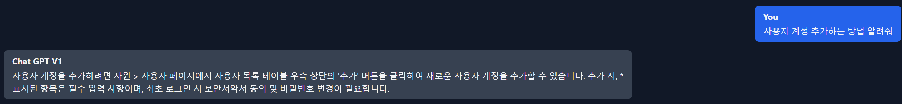
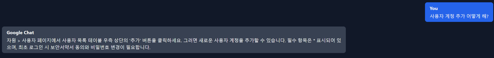

# ACRA Point 메뉴얼 RAG 도입기 - 3

저번 게시글에서 확인한 문제는 Gemini의 성능적 한계가 있기 때문에 임베딩 값을 통해 점수를 정확하게 도출하지 못한다는 문제가 있었습니다.

## 해결방법

### 하이브리드 검색

특히 관리자 매뉴얼과 같은 기술 문서의 경우, 특정 키워드나 전문 용어의 정확한 매칭이 중요하다고 생각합니다.  
그래서 이런 점을 보완하기 위해 하이브리드 접근 방식으로 검색해보자는 아이디어가 떠올랐습니다.  
규칙은 다음과 같습니다.

```text
사용자의 질문을 키워드 단위로 분해하여, 각 섹션과의 매칭 점수를 다음과 같이 보정합니다:

1. 기본 점수: 임베딩 기반의 코사인 유사도 점수
2. 키워드 보정 점수:
  - 질문에서 추출한 키워드가 섹션 제목에 존재할 경우 → 추가 점수
  - 동일 키워드가 섹션 내용에도 존재할 경우 → 추가 점수
```

예시로 다음과 같습니다.

질문이 "사용자 계정 추가 어떻게 해?" 라면 키워드로 [`사용자`, `계정`, `추가`, `어떻게`, `해?`]를 받습니다.

섹션 제목에 키워드가 있으면 추가 점수를 받고 내용에도 키워드가 있으면 추가점수를 받습니다.

그러면 사용자 계정 추가라는 제목을 가진 섹션이 있다면 이 섹션과 매칭될 가능성이 높아집니다. 내용에 사용자 계정 추가에 대한 설명이 적혀있다면 가능성이 더 높아질 것이라고 예상하고 접근했습니다.


```typescript
    const allDocsWithScores = await this.faissStore.similaritySearchWithScore(
      query,
      this.faissStore.index.ntotal(),
    );

    // isMainSection이 true인 문서만 필터링하고 score 정보 유지
    let filteredDocsWithScores = allDocsWithScores.filter(
      ([doc]) => doc.metadata.isMainSection === true,
    );

    // 추가 필터가 있다면 적용
    if (filter) {
      filteredDocsWithScores = filteredDocsWithScores.filter(([doc]) =>
        Object.entries(filter).every(
          ([key, value]) => doc.metadata[key] === value,
        ),
      );
    }

    // 중복 제거: document.metadata.id를 기준으로 가장 높은 점수를 가진 문서만 유지
    const uniqueDocsMap = new Map<string, [Document, number]>();

    filteredDocsWithScores.forEach(([doc, score]) => {
      const existingDoc = uniqueDocsMap.get(doc.metadata.id);
      if (!existingDoc || score > existingDoc[1]) {
        uniqueDocsMap.set(doc.metadata.id, [doc, score]);
      }
    });

    // Map을 배열로 변환하고 점수로 정렬
    const uniqueDocsWithScores = Array.from(uniqueDocsMap.values()).sort(
      ([_, scoreA], [__, scoreB]) => scoreB - scoreA,
    );
```

이전 버전에서는 이렇게 코드가 끝나고 `uniqueDocsWithScores`를 반환하겠지만 여기서 키워드 매칭에 따른 추가 점수 로직을 넣습니다.

```typescript
    const weightedDocs = uniqueDocsWithScores.map(([doc, score]) => {
      let finalScore = score;

      // document의 내용과 제목에 대한 매칭 점수를 한번에 계산
      const documentMatches = this.matcherService.countDocumentMatches(
        query,
        doc,
      );

      finalScore += documentMatches;

      return [doc, finalScore] as [Document, number];
    });

    const sortedDocs = weightedDocs.sort(
      ([_, scoreA], [__, scoreB]) => scoreB - scoreA,
    );

    return sortedDocs.slice(0, k).map(([doc]) => doc);
```

이렇게 추가점수를 준 상태에서 정렬을 하면 예상한 섹션을 가져와서 질문에 대한 답변이 올 것입니다.


### 키워드 추출

키워드 추출은 파이썬을 사용한 구현이라면 형태소분석기 사용이 용이하지만 JS로 구현한다면 형태소 분석기 사용이 다소 어려웠습니다.  
그래서 키워드 추출은 엄격하게 진행하진 않았습니다. 그래도 추출할 수 있는 부분은 최대한 추출해서 진행했습니다.

```typescript
  public countKeywordMatches(
    query: string,
    text: string,
    doc: Document,
  ): number {
    if (!query || !text) return 0;

    // 검색어를 의미있는 키워드로 분리
    const keywords = query
      .trim()
      .split(/[\s,]+/) // 공백이나 쉼표로 분리
      .filter((word) => {
        // 한글이 포함된 경우
        if (/[가-힣]/.test(word)) {
          return word.length >= 2; // 한글은 2글자 이상
        }
        // 영어가 포함된 경우
        if (/[a-zA-Z]/.test(word)) {
          return word.length > 2; // 영어는 3글자 이상
        }
        return false; // 그 외의 경우 제외
      });


    // 검색 대상 텍스트 정규화
    const normalizedText = text
      .replace(/[·・･]/g, '') // 중간점 제거
      .toLowerCase(); // 영문 소문자 변환

    let matches = 0;
    const matchedKeywords = new Set<string>();

    keywords.forEach((keyword) => {
      // 한글 키워드인 경우
      if (/[가-힣]/.test(keyword)) {
        const variations = this.generateKoreanVariations(keyword);
        for (const variation of variations) {
          if (
            normalizedText.includes(variation) &&
            !matchedKeywords.has(keyword)
          ) {
            matches++;
            matchedKeywords.add(keyword);
            break;
          }
        }
      }
      // 영어 키워드인 경우
      else if (/[a-zA-Z]/.test(keyword)) {
        const lowerKeyword = keyword.toLowerCase();
        if (
          normalizedText.includes(lowerKeyword) &&
          !matchedKeywords.has(keyword)
        ) {
          matches++;
          matchedKeywords.add(keyword);
        }
      }
    });

    return matches;
  }

  private generateKoreanVariations(keyword: string): string[] {
    const variations = [keyword];

    // 주요 조사들을 제거한 버전 추가
    const particles = ['이', '가', '을', '를', '은', '는', '의', '로', '으로'];

    particles.forEach((particle) => {
      if (keyword.endsWith(particle)) {
        variations.push(keyword.slice(0, -particle.length));
      }
    });

    // 받침에 따른 조사 변형 고려
    if (keyword.endsWith('으로')) {
      variations.push(keyword.slice(0, -2) + '로');
    }

    return variations;
  }
```

## 결과
---

결과는 좋게 나왔습니다. ChatGPT를 이용했을 때는 당연히 잘 대답했고




gemini-flash-1.5 를 사용했을 때도 잘 대답하는 것을 확인했습니다.




## 글을 마치며
---

ACRA Point 관리자 매뉴얼 RAG 도입기에 대한 과정을 마무리 하려 합니다.

Gemini를 사용할 때는 Chrome AI라는 강력한 도구를 이용할 수 있지만 성능상 한계가 있었고 이를 보완하기 위해서 키워드 매칭 기반 점수 보정 시스템을 도입했습니다.

섹션의 제목과 내용에서 키워드 매칭을 통해 추가점수를 부여하는 단순한 해결방안이였지만 매우 성능이 높아졌습니다. 관리자 매뉴얼과 정확한 용어와 기능 설명이 필요한 문서에서는 이런 하이브리드 접근 방식을 이용할 수 있음을 확인했습니다.

하지만 단점으로는 문서의 구조가 이 코드에 종속될 수 밖에 없다는 단점이 있습니다. 감사합니다.